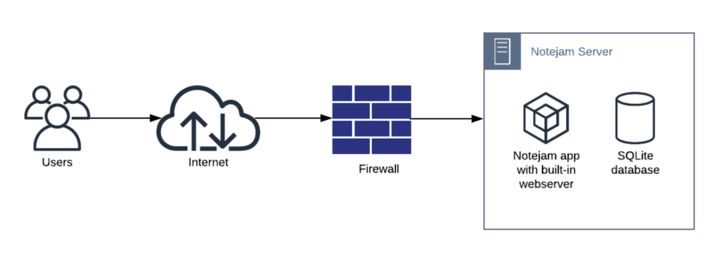
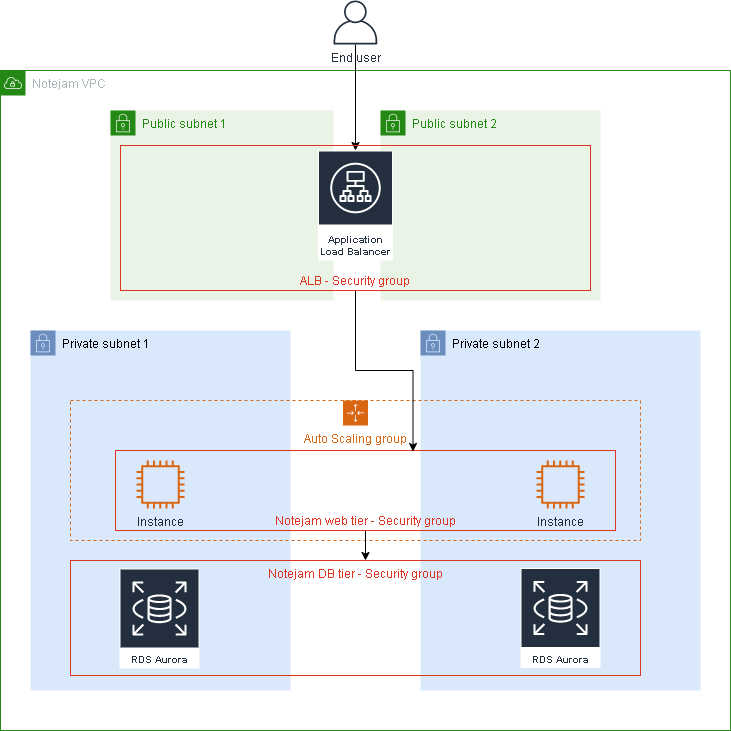
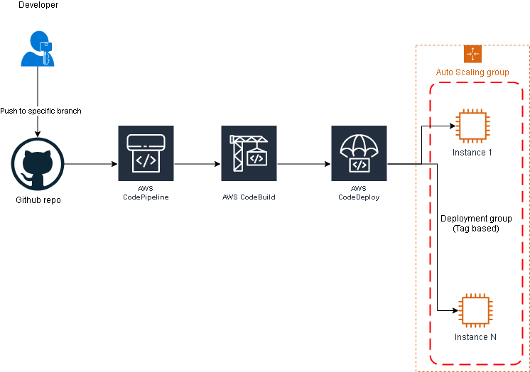

# Notejam project - migration to AWS

## Overview

### Author
Author: László Bodor

Date: 09 August 2021

### Short description

This project aims to present a solution for the migration of the Notejam project to AWS.

This migration handles the Nodejs version of the application.

## Current Architecture

### Current architecture drawbacks

- SQLite database - cannot scale
- The Notejam server is a single instance which is unable to handle the projected traffic
- Also the server is a single point of failure (in case of data center failure)  
- There's no deployment pipeline for the developers
- There's no automated backup for critical data
- It's difficult to migrate the application to other regions
- There are no distinct environments for development, testing and production
- No logging

## Proposed Architecture

The proposed architecture leverages the AWS cloud to offer a highly available, elastic and secure solution for the needs of the customer.
Whenever possible we have chosen AWS services to implement the required functionality. 

### Architecture diagram

### Architectural decisions

- We will use CloudFormation as the tool for deploying the resulting infrastructure to AWS
- Implement a custom VPC in AWS just for the Notejam application
- The VPC will have two private and two public subnets
- Implement distinct security groups for each tier of the architecture
- Security groups will allow access only from group above and on specific ports only 
- Implement an Auto Scaling Group for handling the load to the servers with CPU alarms for high usage. This will trigger automatic scaling of the application.
- Implement an Application Load Balancer with a HTTP listener (HTTPS strongly advised) and a Target Group to route the traffic to
- Replace SQLite with AWS RDS (Aurora) with a failover node in another availability zone
- Use IAM Roles for controlling permissions for specific service to service communication
- Different environments (development, testing, production) will use different AWS accounts to enforce separation of concerns and security.
- For sensitive data like passwords, usernames and db hosts we will use the SSM Parameter Store

### Deployment pipeline diagram

For the deployment pipeline we will use native AWS services connected with a Github repository.

NOTE: The Github repo can easily be substituted with either AWS CodeCommit or Bitbucket.

Once the developers push the code to the specific (deployment) branch then a deployment is kickstarted.

AWS CodePipeline is the main component of this pipeline, it will trigger on push to repo and start the subsequent processes.

AWS CodeBuild will build the project (run npm install in this case) and it will hand off the deployment to AWS CodeDeploy which will use in-place deployment to target specific instances in the deployment group by tags and it will deploy the code to the instance.

During this process CodeDeploy will execute some scripts associated to hooks in the deployment lifecycle.

### Services used

- AWS CloudFormation - to deploy the whole architecture
- AWS EC2 (Instances, Auto Scaling Group, Application Load Balancer)
- AWS VPC (VPC, Subnets, IGW, Routes)
- AWS RDS (Aurora)
- AWS S3 (for DB backups and deployment pipeline artifacts) 
- AWS CodePipeline
- AWS CodeBuild
- AWS CodeDeploy
- IAM (IAM Roles for EC2, CodePipeline, CodeBuild, CodeDeploy)
- SSM Parameter Store (for storing secrets - db credentials)
- GitHub for the code repository

### Satisfaction of Business requirements

1. **The Application must serve variable amount of traffic. Most users are active during business hours. During big
events and conferences the traffic could be 4 times more than typically.**
  
This is achieved by separating the database from the application and using EC2 Auto Scaling Groups. The ASG will react to specific CPU alarms. When load is high (CPU high) the ASG will scale out by adding new EC2 instances to the Auto Scaling Group. The Application Load Balancer will distribute traffic to these instances. 
   
2. **The Customer takes guarantee to preserve your notes up to 3 years and recover it if needed.**
  
This is achieved by using RDS for the database. The DB Cluster is configured for automated backups and the retention of these backups for 35 days. These backups then will be migrated to an S3 bucket with cross-region replication enabled.

3. **The Customer ensures continuity in service in case of datacenter failures.**

We will deploy the application in two distinct availability zones (each tied to a specific subnet). This means that if one AZ goes down the application will continue to work.

4. **The Service must be capable of being migrated to any of the regions supported by the cloud provider in case
of emergency.**
   
The provided CloudFormation template allows the customer to deploy the whole architecture in a new region in a matter of minutes.

5. **The Customer is planning to have more than 100 developers to work in this project who want to roll out
multiple deployments a day without interruption / downtime.**

The deployment pipeline allows the customer to work on the application and use a code repository connected with the deployment pipeline. Once a push is performed to a specific branch the application will be built, tests will run and the deployment will happen without downtime.   

6. **The Customer wants to provision separated environments to support their development process for
development, testing and production in the near future.**
   
Each environment will have a separate AWS account. These can be connected through AWS Organizations for easier management and billing. This is a best practice for reasons of security and separation of concerns. The CloudFormation template allows the selection of the resources and specific code repositories and branches to allow a properly sized environment and the right code to be pushed to these environments.

7. **The Customer wants to see relevant metrics and logs from the infrastructure for quality assurance and
security purposes.**
   
CloudWatch logs will be used for monitoring the infrastructure. The CloudWatch Agent will be installed to instances and will collect data from the Nodejs application. Also other metrics like EC2 instance metrics, RDS metrics, ALB logs and so on will be handled through CloudWatch.

### What still needs to be done (@todo)

- ~~Separation of the database in the Notejam codebase was not done yet. Still need to connect the application to the deployed RDS Aurora Cluster.~~ **DONE** (10 August 2021) - modifications also performed on the forked repo with Notejam codebase  
- Private subnets are not yet implemented, for the moment everything is in public subnets. This is partially due to time constraints but also cost constraints (for HA we need two NAT gateways).
- Security group chaining to be implemented and tested
- provide option in CloudFormation parameters for manually specifying VPC CIDR ranges 
- Unit tests do not yet run automatically - these will be implemented in CodeBuild
- While DB backups are enabled and stored for 14 days they are not automatically migrated to S3 - this still needs to be implemented
- Add parameter to the CloudFormation template for specifying the environment type (development, testing, production)
- test scaling
- provide options in the CloudFormation template parameters to manually specifiy Auto Scaling Group minimum and start sizes
- implement CloudWatch logging for all resources. Also automatically install the CloudWatch agent on instances and collect nodejs application logs.

### Further steps suggested

- Implement AWS WAF for the Load Balancer to filter out unwanted traffic
- Implement the HTTPS listener in the ALB (needs a domain name)

## Demo

The demo of the whole architecture can be deployed via the provided [CloudFormation template](/cloudformation/notejam-infrastructure.yaml)

### Demo prerequisites

----------
**NOTE!!
1. The CloudFormation template has AMI mappings only for the European and North American regions. So it cannot be deployed in regions outside of these two continents.
2. The CloudFormation template only supports the t2 instance family at the moment. So the stack cannot be deployed to instances where t2 is not supported (Milan for example).
3. The deployment of the stack was tested in regions eu-central-1 (Frankfurt) and eu-west-2 (London)**
----------

The forked Notejam repo referenced below contains some additional files needed for CodeDeploy in the deployment pipeline, an appspec.yaml file and a directory named codedeploy with several files in it.

To run the provided CloudFormation template you need to 

1. Fork the repository [https://github.com/lb-demo/notejam](https://github.com/lb-demo/notejam)
2. Create a personal Github access token (or ask one). Go to [Github settings -> Developer settings -> Personal access tokens](https://github.com/settings/tokens) and create your token by giving it a name and checking the "repo" checkbox.
3. Go to the EC2 console (Key Pairs) and create a key pair
4. Go to SSM Parameter Store and create the following parameters for the RDS database:
    - **/Notejam/Database/DBName** - this will be the inital database name of the RDS DB Cluster 
    - **/Notejam/Database/DBPassword** - this will be the password for the database
    - **/Notejam/Database/DBUser** - this will be the database user for the database 
    

Then go to the CloudFormation console and launch a new stack. After uploading the template you will be asked some details (need to fill in parameters)

1. **Branch** - this will be your deployment branch. Default is "master"
2. **GithubOAuthToken** - this will be the personal Github access token obtained above
3. **InstanceType** - the desired instance type - we allow for the moment only the t2 family
4. **KeyName** - the keypair name which will be attached to your instances and can be used for SSH access. You need to create a key pair beforehand.
5. **RepoOwner** - this is the owner of the github repository. Usually this is your username. Default is lb-demo
6. **Repository** - this is the name of the github repository we use for deployment
7. **SSHLocation** - this is the IP address from which SSH access will be permitted in the security groups.
8. **WebServerCapacity** - this is the maximum number of EC2 instances the Auto Scaling Group is allowed to scale to

Once these options are filled in, CloudFormation deploys a stack containing all the resources needed to run the application and the deployment pipeline. 

### CloudFormation Outputs

In the Outputs of the CloudFormation stack the url of the ALB is provided. This can be used to access the Notejam application.

